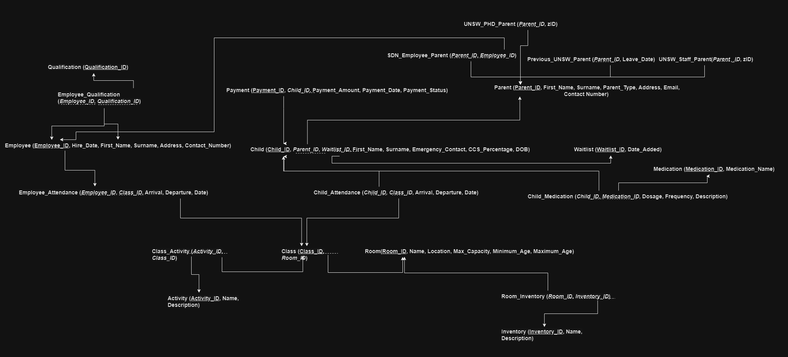

# COMM2822-Ass02 
This repo contains build scripts for the second COMM2822 Assignment.
## Code
 Scripts are organised in the following heirarchy:
 ### `./build/` 
 Build scripts for table creation. Each table has a unique sql file, that will be collated for submission. 
 ### `./insert/`
 Insertion scripts containing dummy data.
 ### `./final/`
 Final scripts for submission, as per assignment spec (one for build and one for insert - check). These are the scripts that will be run against the Oracle DB.

 ### `./select/`
 Select scripts (to be written by Jamie).

 ### Other stuff (feel free to ignore):
 ### `./misc/`
 Miscellaneous/old SQL build files && test scripts.

 ### `./src/`
 Files used by this Markdown code.

## ER Diagram
Below is the ER diagram for the database. Tables and keys are derived from the Entity-Relationship model below.

